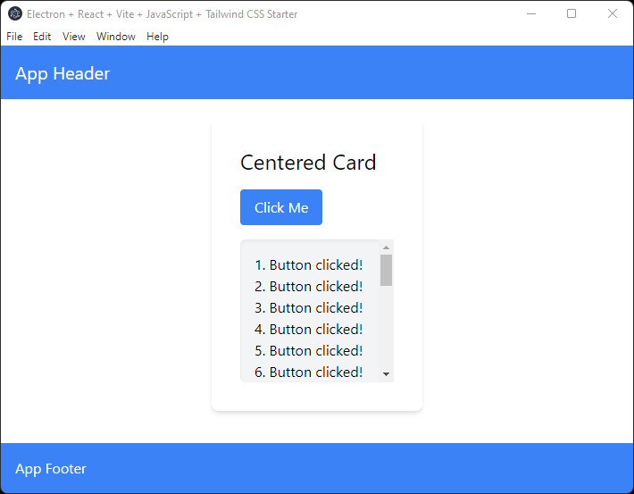

# Electron + React + Vite + JavaScript + Tailwind CSS Starter

This is a template for building Electron apps with Vite, React, JavaScript, Tailwind CSS. It's based on [Anthony Leotta's Electron + React + Vite + JavaScript Start](https://github.com/datajango/react_vite_js_starter)

* Features
    1. React
    2. Vite
    3. JavaScript
    4. Electron
    5. VS Code debugging
    6. Tailwind CSS

## Screenshot



## Debugging


## Getting Started

Clone this repository locally :

```bash
git clone git@github.com:datajango/react_vite_js_tw_starter.git "your app name goes here"
``` 

Install dependencies with npm :

```bash
npm install
```

Start development server :

```bash
npm run dev
```
